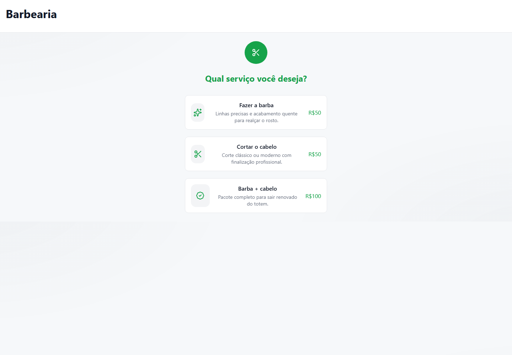
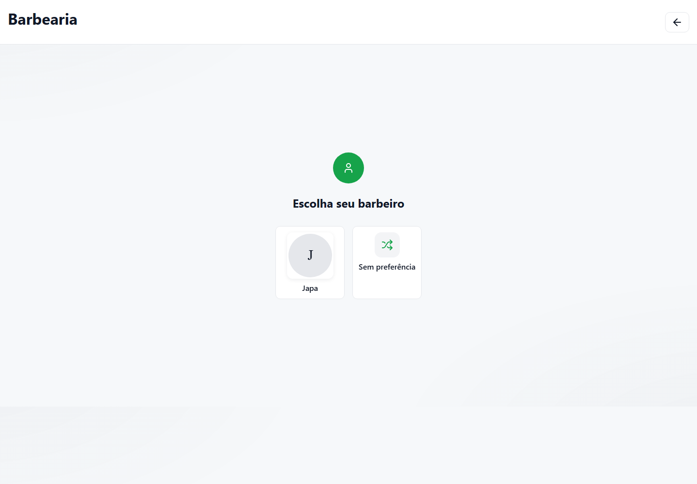
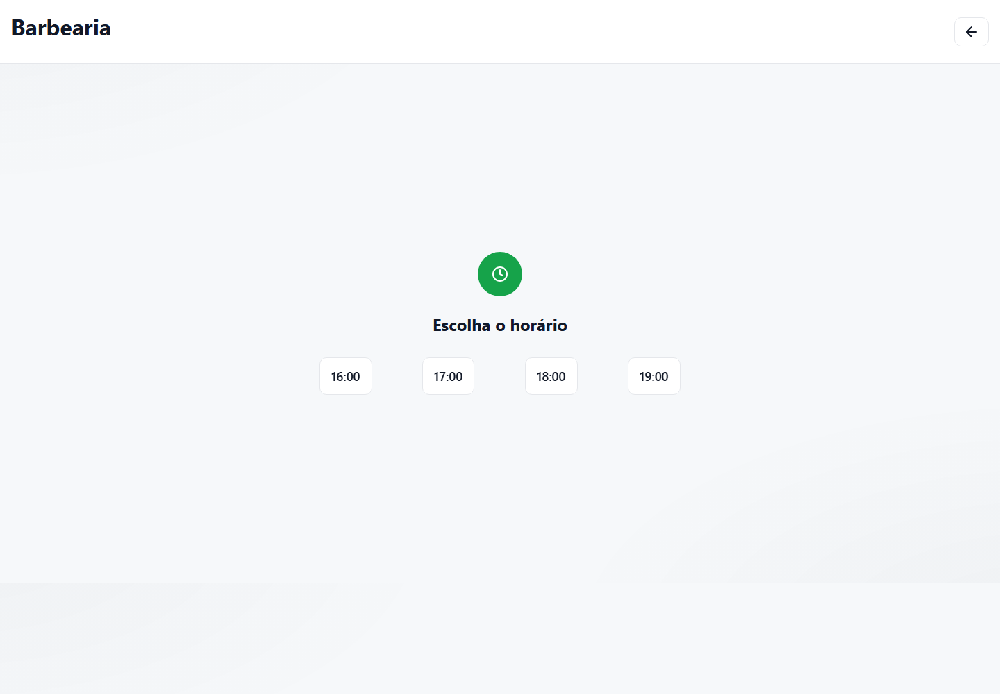
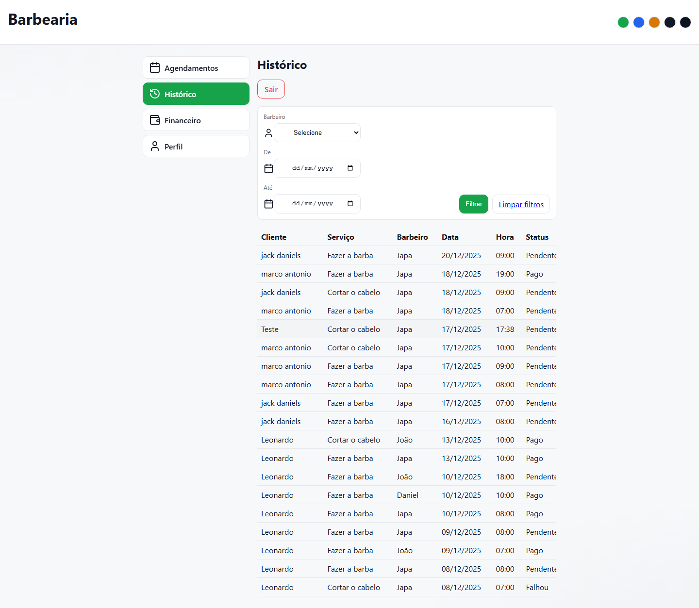
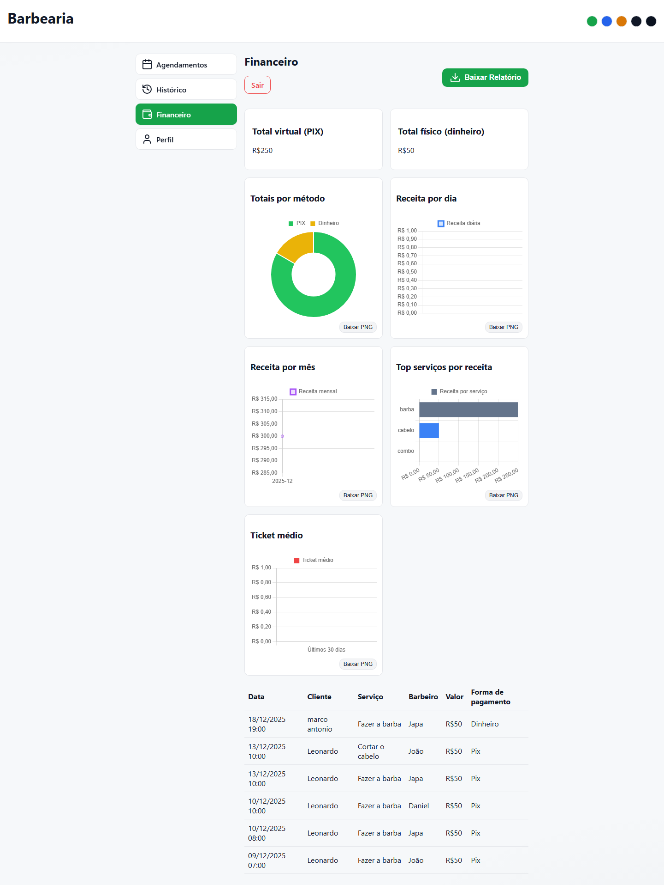

# Barber Shop Management System

Management system for barber shops, developed in Django. Includes online scheduling, administrative dashboard, payment integration via Pix (AbacatePay), and automatic reminders via WhatsApp (Evolution API).

## Screenshots

### Online scheduling







### Administrative dashboard





## Features

- **Online Scheduling:** Interface for clients to schedule appointments, choosing barber, service, date, and time.
- **Administrative Dashboard:** Panel to manage appointments, view financial history and metrics.
- **Pix Payments:** Generation of Pix QR Code via integration with AbacatePay.
- **WhatsApp Reminders:** Automatic sending of appointment reminders via Evolution API.
- **User Management:** Access control and user profiles.

## Technologies Used

- **Backend:** Python 3, Django 5
- **Database:** SQLite (default), extensible to PostgreSQL
- **Containerization:** Docker, Docker Compose
- **Web Server:** Nginx, uWSGI
- **Integrations:**
  - [Evolution API](https://github.com/EvolutionAPI/evolution-api) (WhatsApp)
  - [AbacatePay](https://abacatepay.com/) (Pix Payments)

## Prerequisites

- [Docker](https://www.docker.com/)
- [Docker Compose](https://docs.docker.com/compose/)

## Installation and Execution

1. **Clone the repository:**

```bash
git clone https://github.com/your-username/barbershop.git
cd barbershop
```

2. **Configure the environment variables:**

Create a `.env` file in the project root with the following variables:

```env
SECRET_KEY=your_secret_django_key
DEBUG=True

# Self-Service Token Settings
SELF_SERVICE_TOKEN_KEY=your_secret_token
REQUIRE_SELF_SERVICE_TOKEN=False

# Evolution API Integration (WhatsApp)
EVOLUTION_API_URL=http://evolution_api:8080
EVOLUTION_API_KEY=your_evolution_api_key
AUTHENTICATION_API_KEY=your_authentication_key

# AbacatePay Integration
ABACATEPAY_KEY=your_abacatepay_api_key
```

3. **Run with Docker Compose:**

```bash
docker-compose up --build
```

The system will start the following services:

- `app`: Django application (port 8000)
- `nginx`: Web server (port 80)
- `evolution-api`: WhatsApp API (port 8082)
- `reminder-worker`: Worker for sending reminders

4. **Access the application:**

- **Web:** http://localhost
- **Django Admin:** http://localhost/admin

## Project Structure

- `core/`: Main project configurations.
- `scheduling/`: Scheduling and time management app.
- `dashboard/`: Custom administrative panel.
- `payments/`: Payment gateway integration.
- `users/`: User management and authentication.
- `docker-compose.yml`: Container orchestration.

## Contribution

Contributions are welcome! Feel free to open issues or submit pull requests.

## License

[MIT](LICENSE)
